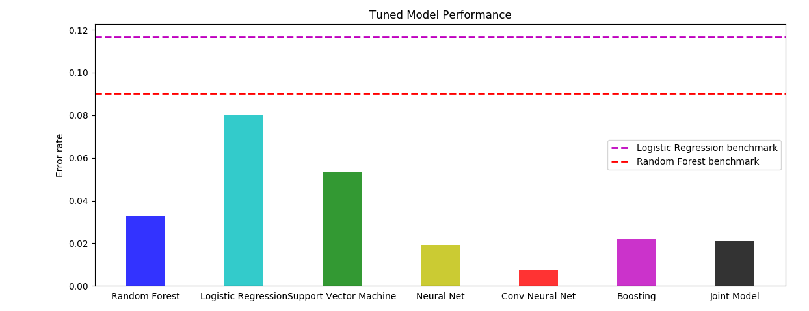

# Supervised learning: classifying the MNIST digits dataset with a variety of models

Here's an approach to a canonical machine learning problem: classifying handwritten digits. The MNIST dataset is a set of 70,000 handwritten digits stored as 28 x 28 floating greyscale values, split into a training set of 60,000 samples and a testing set of 10,000 samples. As an exercise we can build a set of models to learn to classify the MNIST dataset and see how they perform. Here I build a:
* Random forest classifier
* Logistic regression classifer
* Support vector machine classifier
* Neural network (multi-layer perceptron)
* Boosting with LightGBM
* Convolutional neural network
* Joint voting classifer using the above five models.

## "784" Models

First we can transform each 28 x 28 sample into a 784-dimensional vector, 'flattening' the images. Each of the models (except the conv. neural network) expects vectors of particular dimension instead of matrices, so we flatten the samples first.

Each of these models have a set of hyperparameters that are specified before training. We split the training set into a smaller training set and validation set and train the models with a variety of different settings of hyperparameters to find hyperparameters that seem to maximize the accuracy on the validation set.

### Random forest

We can train a random forest decision tree classifier from the sklearn library and gridsearch to tune the hyperparameters `n_estimators`, `max_depth`, and `max_features`, finding that values of `n_estimators` = 47, `max_depth` = 130, and `max_features` = `sqrt` seem to give the best validation scores.

### Logistic regression

Here we tune the regularization parameter, finding that C = 0.375 performs best on validation.

### Support vector machine

We can also train a support vector machine to perform classification, tuning the kernel and regularization parameter, finding that a linear kernel and regularization C = 0.05 works well.

### Neural network

We can also build a classic MLP neural network via Keras to perform classification. We explore a variety of network structures, regularization parameters, activation functions, and dropout factors to tune the network, settling on a deep neural network (4 hidden layers, one of size 1568 and three of size 784) and tanh activation.

### Boosting classifiers

We also use LightGBM to train boosting classifiers, similar process as above.

## Other models

### Convolutional neural network

The handwritten digits are images- naturally we can try a convolutional neural network to classify the images. We explore a variety of convolutional layers and pooling layers as well as window size and step size to tune the conv neural net.

### Joint voting model

Now that we've built five models to classify the digits, we can build a sixth model that combines the previous five, combining weighted votes from each model. Each model is weighted according to its performance on the validation subset.

## Results

Now we have six models that have learned to classify the MNIST dataset by learning on the training set. Now we can run them on the test set to see how they perform on samples they have not seen before. The results are listed below, including some baselines which are untuned out-of-the-box versions of random forest and logistic regression (we didn't try to tune their parameters to the problem at all).

Model | Accuracy | Error rate (1 - Accuracy)
------|--------- | ---------
Random forest baseline | 0.9098 | 0.0902
Logistic regression baseline | 0.8832 | 0.1168
------|--------- | ------- | ---------
Random forest | 0.9674 | 0.0326
Logistic regression | 0.9201 | 0.0799
Support vector machine | 0.9466 | 0.0534 
Neural network | 0.9807 | 0.0193
Conv. neural network | 0.9922 | 0.0078
Boosting | 0.9781 | 0.0219
Joint model | 0.9789 | 0.0211

Here is a plot of the error rate for each model:

We find that the convolutional neural network performs the best, learning to recognize written digits with greater than 99% accuracy. This is unsurprising as the conv neural net takes advantage of the image-structure of the data rather than viewing each pixel independently like the rest of the models do. 

It is also interesting that the joint model performs worse than some of the individual models. It seems that the models frequently misclassify the same digits- if the models never collided in misclassifying digits, the models would every time get outvoted by the others leading to 100% accuracy. Perhaps digits like 1 and 7 are tricky and are often misclassified, leading to a poorer overall accuracy.